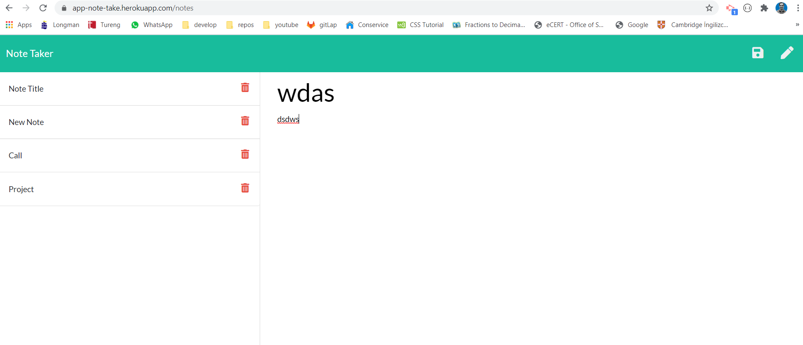

# Note Taker

## Description

🔍 A node.js express.js application that uses user input to create, store and delete notes. 

💻 Below is the picture of the application:




Application deployed live on [heroku](https://app-note-take.herokuapp.com/)


## User Story
```
AS A user, I want to be able to write and save notes
I WANT to be able to delete notes I've written before
SO THAT I can organize my thoughts and keep track of tasks I need to complete
```

## Acceptance Criteria
```
Application should allow users to create and save notes.
Application should allow users to view previously saved notes.
Application should allow users to delete previously saved notes.
```

## Installation

You will need the npm packages 'express', 'path', 'moment' and 'fs'. Just 'npm i' . 


## Usage
​This application is used for taking notes and save them on the server side for later retrieval.


## Contributing

​Contributor: [Hasan Utku](https://github.com/hhutku)


